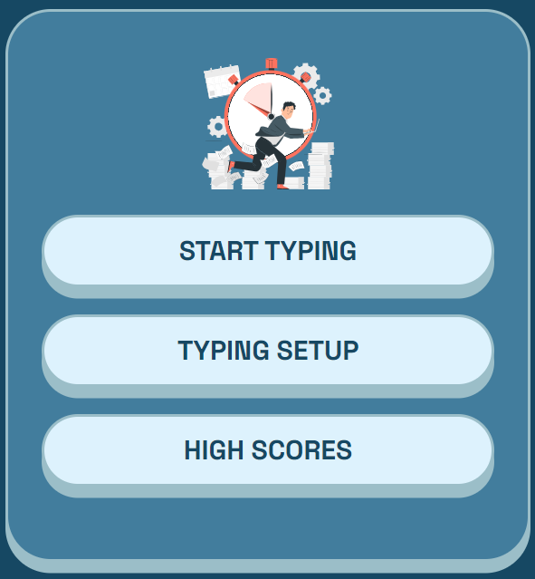
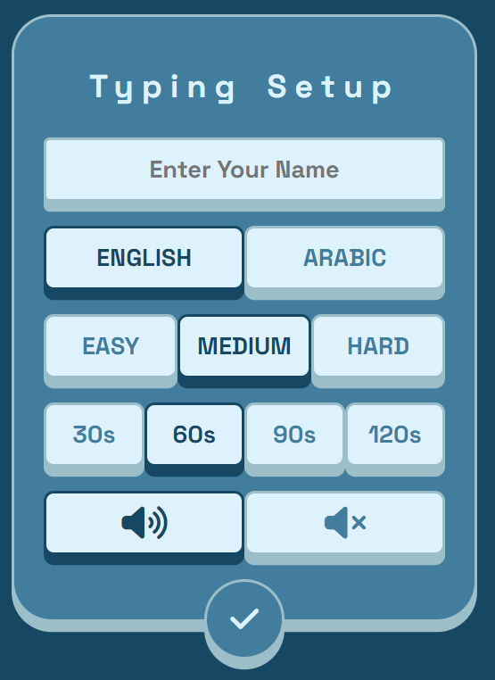
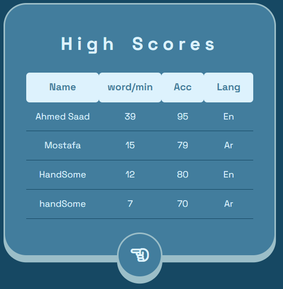
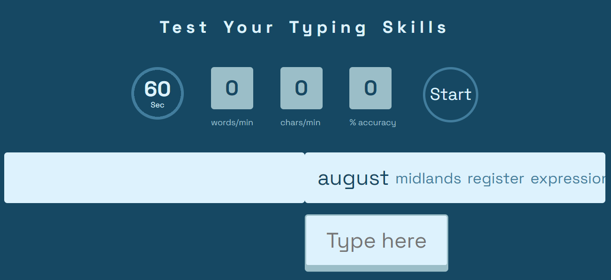
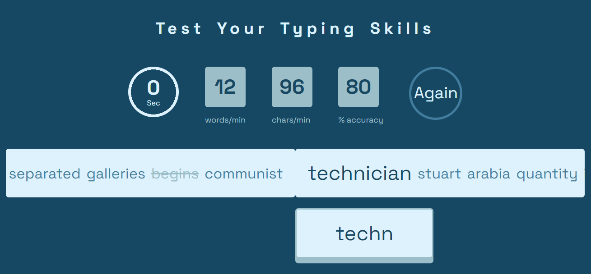
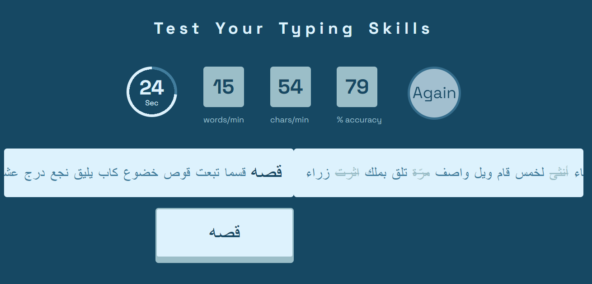

# Typing-Speed-App
This is an app for testing your typing speed in many languages with different levels and times.
## Covered Topics
  - html5
  - Sass /css3
  - javaScript / Es6 / TypeScript
  - Dom / Bom / Json / sound / classes / interfaces
## App Functionalities
  - Before Playing you make your typing setup.
  - Your Nmae, select your Language (English/ Arabic),
  - select your Level (Easy/ Medium/ Hard),
  - select your Time (30/ 60/ 90/ 120) sec,
  - play sounds or not.
  - you can show your high scores sorting according to your words per min and accuarcy.
  - when clicking start:
  - the timer will go down according this time write as many as correct words in the input field.
  - during typing you will see the correct words wrongs words chars/min, words/min and the accuarcy.
  - in every char input there is a sound effects and in corrects words, wrongs words, after finishing the typing.
  - after fininshing you can make it again, again and again.
# Site ScreenShot

